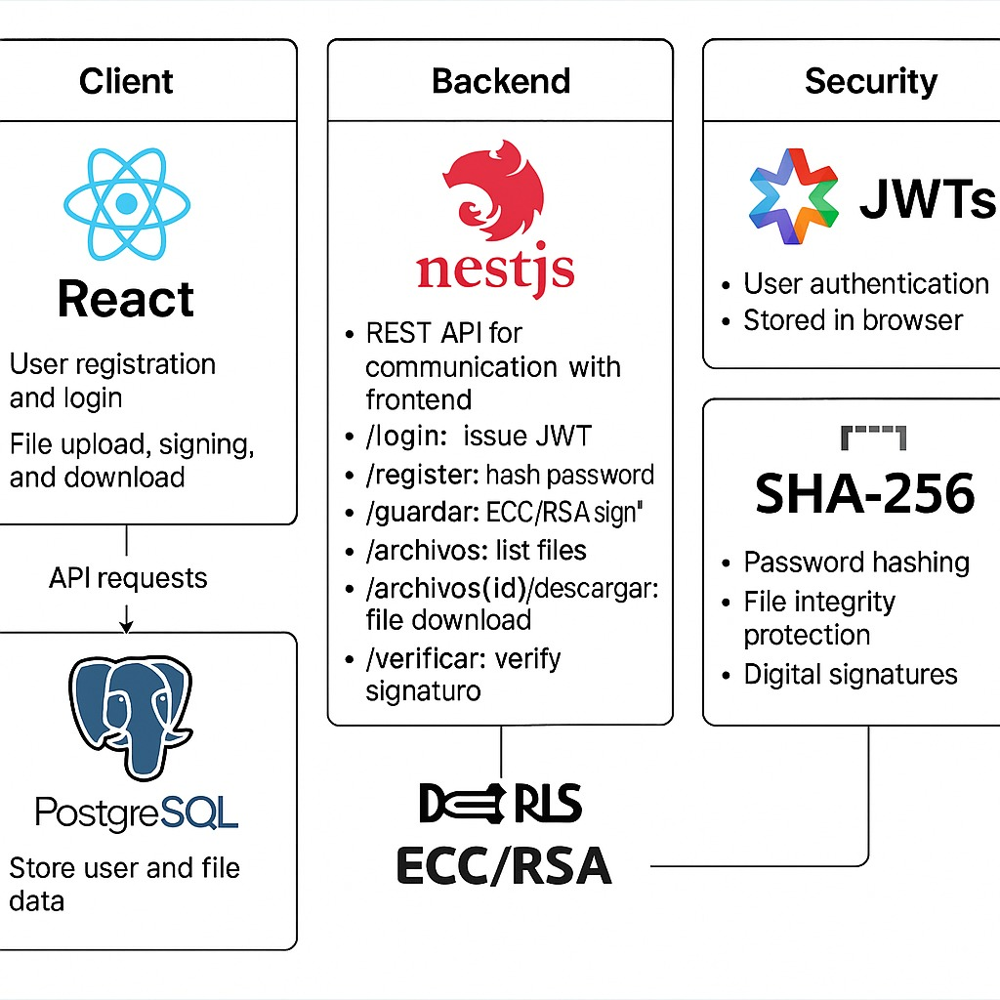

#  Secure File Upload System with Digital Signatures

Este proyecto permite a los usuarios autenticarse, subir archivos, firmarlos digitalmente (RSA o ECC), verificar su integridad con SHA-256 y descargarlos de forma segura. Combina un frontend desarrollado en **Next.js** con un backend robusto usando **NestJS** y una base de datos **PostgreSQL**.

---

##  Arquitectura General




---

##  Tecnologías Utilizadass

### Frontend (Next.js)
- Autenticación con JWT
- Formularios de Login y Registro
- Generación de llaves públicas/privadas ECC o RSA
- Subida y verificación de archivos
- Almacenamiento de JWT en localStorage

###  Backend (NestJS)
- API RESTful
- Endpoints:
  - `POST /login`: genera JWT
  - `POST /register`: registra usuarios con contraseña hasheada (SHA-256)
  - `POST /guardar`: guarda archivos con firma (RSA o ECC) y hash
  - `GET /archivos`: lista archivos del usuario autenticado
  - `GET /archivos/:id/descargar`: descarga archivo + clave pública
  - `POST /verificar`: verifica la firma digital e integridad

### Seguridad
- JWTs para autenticación basada en tokens
- SHA-256 para hash de contraseñas y archivos
- RSA/ECC para firma digital
- PostgreSQL como base de datos relacional

---

##  Estructura de Carpetas

###  Frontend (Next.js)

```
frontend/
├── components/
│   ├── LoginForm.jsx
│   ├── RegisterForm.jsx
│   ├── FileUploader.jsx
│   ├── FileList.jsx
│   └── VerifyFile.jsx
├── services/
│   └── api.js
├── utils/
│   └── crypto.js
├── pages/
│   ├── index.js
│   └── home.js
└── public/
```

###  Backend (NestJS)

```
backend/
├── src/
│   ├── auth/
│   ├── users/
│   ├── files/
│   ├── crypto/
│   └── main.ts
```

---

##  Seguridad y Flujo

1. **Registro**:
   - Contraseña hasheada con SHA-256
   - Clave pública guardada en la base de datos
   - Clave privada descargada por el usuario

2. **Autenticación**:
   - Usuario inicia sesión → recibe JWT
   - JWT almacenado en el navegador (localStorage)
   - Usado en cada solicitud protegida

3. **Subida y Firma de Archivos**:
   - Se genera hash SHA-256 del archivo
   - Se firma usando la clave privada del usuario (ECC o RSA)
   - Se guarda junto con el archivo en la base de datos

4. **Verificación**:
   - Al descargar un archivo, se recupera su hash y firma
   - El frontend puede verificar con la clave pública

---

##  Base de Datos

### Tabla `users`
| Campo | Tipo |
|-------|------|
| email (PK) | varchar |
| password | text (SHA-256 + salt) |
| nombre | varchar |
| public_key | text |

### Tabla `files`
| Campo | Tipo |
|-------|------|
| id (PK) | uuid |
| nombre | text |
| user_id | varchar (FK) |
| content | bytea |
| hash | text |
| firma | text |
| algoritmo | text (RSA o ECC) |


##  Funcionalidades Implementadas

- [x] Login/Register con JWT
- [x] Firma digital con ECC o RSA
- [x] Protección de integridad con SHA-256
- [x] Subida y descarga de archivos
- [x] Verificación de archivos firmados

---

##  Licencia

MIT License © 2025

---